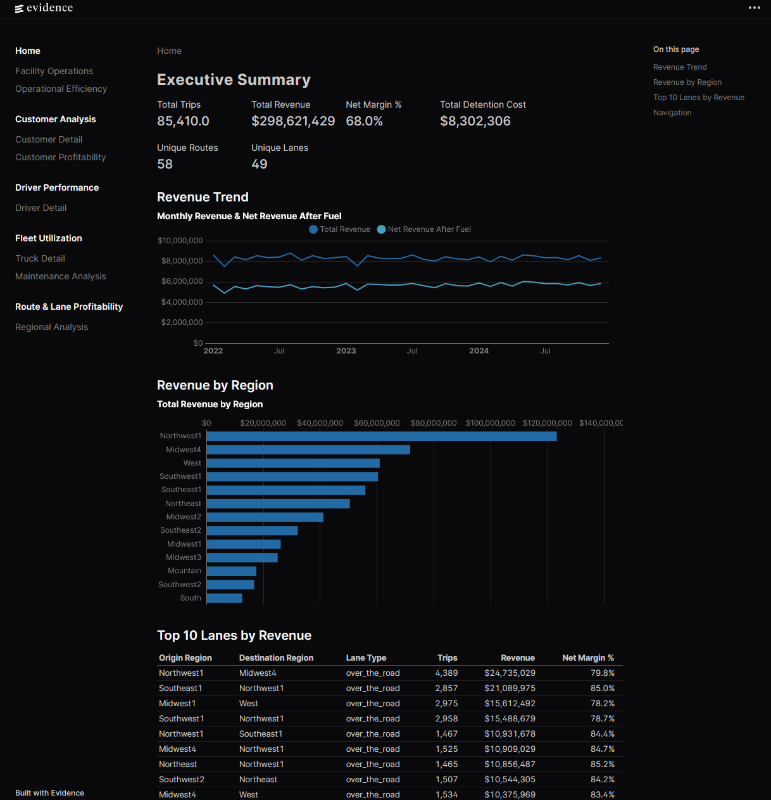

# Logistics Data Analytics Platform

A logistics analytics platform built with DuckDB, dbt, and Evidence. The project transforms raw operational data into a modeled data mart and presents it through 13 interactive dashboard pages.



## Architecture

```
Raw Data (CSV) → DuckDB → dbt (staging → intermediate → marts) → Evidence (dashboards)
```

- **Database:** DuckDB (`data/logistics.duckdb`)
- **Transformation:** dbt with 42 SQL models across staging, intermediate, and mart layers
- **Dashboards:** Evidence (evidence.dev) — code-based BI generating a static site from markdown + SQL + chart components

## Data

85,410 trips across 50 drivers, 100 trucks, 49 lanes, 58 routes, 10 regions, 25 customers, and ~200 facilities (2022–2024).

## Dashboard Pages

| # | Page | URL Path |
|---|---|---|
| 1 | Executive Summary | `/` |
| 2 | Driver Performance | `/drivers` |
| 3 | Driver Detail | `/drivers/detail` |
| 4 | Fleet Utilization | `/fleet` |
| 5 | Truck Detail | `/fleet/detail` |
| 6 | Maintenance Analysis | `/fleet/maintenance` |
| 7 | Route & Lane Profitability | `/routes` |
| 8 | Regional Analysis | `/routes/regions` |
| 9 | Customer Analysis | `/customers` |
| 10 | Customer Detail | `/customers/detail` |
| 11 | Customer Profitability | `/customers/profitability` |
| 12 | Facility Operations | `/facilities` |
| 13 | Operational Efficiency | `/operations` |

Detail pages (3, 5, 10) use client-side dropdown selectors — all data is embedded at build time, no server-side rendering required.

## Minimum Requirements

| Tool       | Minimum Version | Recommended |
|------------|-----------------|-------------|
| Git        | 2.x+            | 2.47+       |
| Python     | 3.9+            | 3.13+       |
| Node.js    | 18.x+           | 20.x LTS    |
| npm        | 7.x+            | 10.x+       |
| OS         | macOS, Windows 10+, or Linux (Ubuntu 20.04+, Fedora 36+) | |
| Disk Space | ~1.5 GB (dependencies + database + build output) | |

**Windows only:** [Microsoft Visual C++ Redistributable](https://aka.ms/vs/17/release/vc_redist.x64.exe) is required.

> **Note:** dbt, DuckDB, pandas, and scikit-learn are installed automatically inside a virtual environment by the init script. You only need Python itself pre-installed.

## Quick Start

### 1. Prerequisites

Install **Git**, **Python 3 (>= 3.9)**, and **Node.js (>= 18)** if not already installed.

<details>
<summary>macOS</summary>

```bash
brew install git python node
```
</details>

<details>
<summary>Windows</summary>

- **Git:** Download and install from https://git-scm.com/download/win
- **Python 3:** Download and install from https://www.python.org/downloads/ (check "Add to PATH")
- **Node.js:** Download and install from https://nodejs.org (LTS version recommended)
- **Microsoft Visual C++ Redistributable:** Download and install from https://aka.ms/vs/17/release/vc_redist.x64.exe

After installation, restart your terminal, then enable PowerShell script execution:

```powershell
Set-ExecutionPolicy -ExecutionPolicy RemoteSigned -Scope CurrentUser
```
</details>

<details>
<summary>Linux (Ubuntu/Debian)</summary>

```bash
sudo apt-get update
sudo apt-get install -y git python3 python3-venv
curl -fsSL https://deb.nodesource.com/setup_20.x | sudo bash -
sudo apt-get install -y nodejs
```
</details>

<details>
<summary>Linux (Fedora/RHEL)</summary>

```bash
sudo dnf install -y git python3
curl -fsSL https://rpm.nodesource.com/setup_20.x | sudo bash -
sudo dnf install -y nodejs
```
</details>

Verify on any platform:

```bash
git --version       # should show 2.x+
python3 --version   # should show 3.9+ (use 'python --version' on Windows)
node --version      # should show v18+
npm --version       # should show 7+
```

### 2. Clone and Run

**macOS / Linux:**

```bash
git clone https://github.com/joshlizana/Logistics-Data-Modeling.git
cd Logistics-Data-Modeling
./init.sh
```

**Windows (PowerShell):**

```powershell
git clone https://github.com/joshlizana/Logistics-Data-Modeling.git
cd Logistics-Data-Modeling
.\init.ps1
```

The script handles everything automatically and serves the dashboard when done. Open **http://localhost:3000** in your browser.

Under the hood it will:
1. Verify that all prerequisites are installed
2. Create a Python virtual environment and install dependencies (dbt, duckdb, pandas, scikit-learn)
3. Rebuild the DuckDB database from raw CSVs
4. Run all dbt models (staging → intermediate → marts)
5. Link the database into the Evidence source directory
6. Install Evidence npm dependencies
7. Build the Evidence dashboard
8. Serve the production site on port 3000

## Development

To run the Evidence dev server with hot reload:

```bash
cd evidence-app
npm run dev
```

This opens the site at `http://localhost:3000` with live reloading as you edit the markdown pages. The dev server shows query viewers alongside charts for debugging — these are hidden in the production build. If query viewers persist in your browser after switching to the production build, clear your browser's localStorage or use an incognito window.

## Project Structure

```
Logistics-Data-Modeling/
├── init.sh                            ← Setup script for macOS/Linux
├── init.ps1                           ← Setup script for Windows
├── config/
│   └── clustering.json               ← Data clustering configuration
├── data/
│   ├── logistics.duckdb              ← DuckDB database (generated by init script)
│   ├── raw/                          ← Raw CSV source files
│   └── reference/                    ← Reference data files
├── scripts/
│   ├── build.py                      ← Database build script
│   ├── load_raw.py                   ← Raw data loader
│   └── logger.py                     ← Logging utility
├── logistics_modeling/                ← dbt project
│   └── models/
│       ├── staging/                   ← Raw table staging
│       ├── intermediate/              ← Enriched trip grain
│       └── marts/                     ← Analytical models
│           ├── customer_analysis/
│           ├── dimensions/
│           ├── driver_performance/
│           ├── fleet_utilization/
│           └── route_profitability/
├── evidence-app/                      ← Evidence dashboard project
│   ├── sources/logistics/             ← DuckDB connection + source queries
│   ├── pages/                         ← Dashboard markdown pages
│   │   ├── index.md                   ← Executive Summary
│   │   ├── customers/                 ← Customer dashboards
│   │   ├── drivers/                   ← Driver dashboards
│   │   ├── facilities/                ← Facility dashboards
│   │   ├── fleet/                     ← Fleet dashboards
│   │   ├── operations/                ← Operations dashboards
│   │   └── routes/                    ← Route dashboards
│   └── build/                         ← Static site output (generated by init script)
├── visualizations.md                  ← Dashboard specification & decision log
├── mart_models.md                     ← Data mart design document
├── staging_tables.md                  ← Staging layer design document
└── DATABASE_SCHEMA.txt                ← Database schema reference
```

## Troubleshooting

<details>
<summary>PowerShell: "not recognized as the name of a cmdlet"</summary>

PowerShell blocks scripts by default. Run this once before cloning:

```powershell
Set-ExecutionPolicy -ExecutionPolicy RemoteSigned -Scope CurrentUser
```
</details>

<details>
<summary>Port 3000 already in use</summary>

Another process is using port 3000. Either stop it or edit the `npx serve build` line in the init script to use a different port:

```bash
npx serve build -l 4000
```
</details>

<details>
<summary>ModuleNotFoundError during database rebuild</summary>

The Python virtual environment may be incomplete. Delete it and re-run the init script:

```bash
rm -rf venv    # macOS/Linux
./init.sh

# or on Windows:
Remove-Item -Recurse -Force venv
.\init.ps1
```
</details>

<details>
<summary>dbt models fail with "Table does not exist"</summary>

The database rebuild step (`scripts/build.py`) failed or was skipped. Check the init script output for errors above the dbt step. The raw tables must be loaded into `data/logistics.duckdb` before dbt can run.
</details>

<details>
<summary>Query viewers visible on the production site</summary>

Evidence's query viewer toggle is stored in your browser's localStorage. It defaults to visible in dev mode and can persist when switching to the production build. Clear it by opening the site in an incognito window or toggling the `</>` button in the bottom-left corner.
</details>

## Tech Stack

| Layer | Tool | Description |
|-------|------|-------------|
| Database | [DuckDB](https://duckdb.org) | In-process analytical database |
| Transformation | [dbt](https://docs.getdbt.com) | SQL-based data transformation framework |
| dbt Adapter | [dbt-duckdb](https://github.com/duckdb/dbt-duckdb) | DuckDB adapter for dbt |
| Dashboards | [Evidence](https://evidence.dev) | Code-based BI tool generating static sites from markdown + SQL |
| Data Processing | [pandas](https://pandas.pydata.org) | Data manipulation for reference table builds |
| Clustering | [scikit-learn](https://scikit-learn.org) | Region clustering from facility coordinates |

## Documentation

- `visualizations.md` — Full specification for all 13 dashboard pages including queries, charts, and design decisions
- `mart_models.md` — Data mart layer design and model documentation
- `staging_tables.md` — Staging table definitions and source mappings
